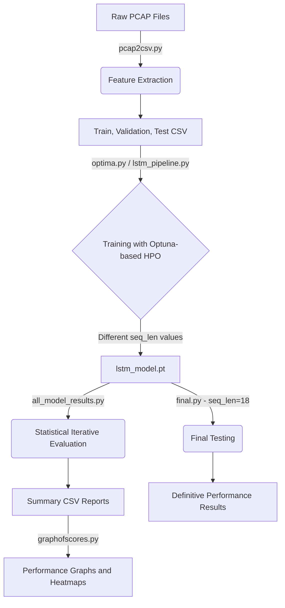

# Analysis of the IoT Network Traffic Classification Project

This project is an end-to-end machine learning (LSTM) pipeline designed to classify IoT (Internet of Things) devices by analyzing their network traffic data (PCAP files). The main focus of the project is to transform network packet features into time-series sequences and investigate the effect of different sequence lengths (`seq_len`) on model performance.

The project is logically divided into four main phases:

---

# Phase 1: Data Extraction and Preprocessing
**Related File:** `pcap2csv.py`

This stage transforms raw network traffic data into meaningful features suitable for deep learning models.

- **Data Reading:** Raw `.pcap` (Packet Capture) files from the `IoT-Sentinel` dataset are parsed using the *Scapy* library.
- **Feature Engineering:** For each packet, **25 different features** are extracted according to the layers of the OSI model. These include:
  - **Protocol Information (Layers 2, 3, 4, and 7):** Presence detection of ARP, LLC, IP, ICMP, TCP, UDP, HTTP, DNS, DHCP, and similar protocols.
  - **Packet Metrics:** Packet size (`Pck_size`) and port classifications (`Portcl_src`, `Portcl_dst`).
  - **Data Complexity:** The **Shannon Entropy** of the payload is calculated to measure the complexity of the transmitted data.
- **Labeling:** Device MAC addresses are matched with a predefined list of IoT devices, creating the target variable (`Label`).
- **Output:** After analysis, packets are separated into Train, Validation, and Test groups and saved as CSV files.

---

# Phase 2: Model Training and Hyperparameter Optimization (HPO)
**Related Files:** `lstm_pipeline.py`, `optima.py`

In this phase, an LSTM (Long Short-Term Memory) neural network is trained on the extracted features, and hyperparameter optimization is performed.

- **Time-Series Transformation:** Data loaded from CSV files is standardized using `StandardScaler`, while labels are numerically encoded with `LabelEncoder`. Then, using sliding window techniques, the data is transformed into sequential tensors according to the `seq_len` parameter.
- **Deep Learning Architecture:** A dynamically configurable `LSTMClassifier` model is implemented in PyTorch, supporting options such as bidirectionality and variable layer counts.
- **Hyperparameter Optimization:** The `Optuna` library is used to search for the optimal learning rate (`lr`), number of layers (`num_layers`), bidirectionality (`bidirectional`), and hidden layer size (`hidden_size`). To address class imbalance, class weights are applied during training.
- **Automation (`optima.py`):** The model is automatically trained for a specified range of `seq_len` values (e.g., between 17 and 20).
- **Output:** The best-performing model (`lstm_model.pt`), confusion matrices (`confusion_matrix.pdf`, `.csv`), and learning curve graphs are saved.

---

# Phase 3: Statistical and Comparative Evaluation
**Related Files:** `final_evaluation_and_stats.py`, `all_model_results.py`, `final.py`

This phase measures the statistical reliability and consistency of the trained model through multiple evaluation iterations.

- **Iterative Evaluation (`final_evaluation_and_stats.py`):** The previously trained model is loaded and evaluated on the test dataset for a specified number of iterations (e.g., 30 runs). During each iteration, metrics such as `Accuracy`, `Balanced Accuracy`, `Precision`, `Recall`, `F1-Score`, `Cohen’s Kappa`, and execution time are recorded.
- **Batch Comparison (`all_model_results.py`):** To analyze the effect of sequence length (`n=2` to `20`) on model performance, the evaluation script is automatically executed in a loop.
- **Final Decision (`final.py`):** A final and definitive evaluation is conducted on the main test dataset (`Test_IoTDevIDv1.csv`) using the identified optimal parameter `seq_len=18`.
- **Output:** Detailed iteration logs and summary CSV reports containing statistical averages and standard deviations are generated.

---

# Phase 4: Visualization
**Related File:** `graphofscores.py`

This phase converts the statistical summaries obtained in Phase 3 into graphical visualizations.

- **Data Aggregation:** All summary CSV reports for sequence lengths from 2 to 20 are collected and merged into a single DataFrame.
- **Graph Outputs:**
  - `performance_metrics.pdf`: A line graph showing how core metrics (F1, Accuracy, etc.) change with sequence length (x-axis).
  - `execution_time.pdf`: A performance graph illustrating how inference time varies with sequence length.
  - `metric_distribution.pdf` (and its normalized version): Heatmaps representing the distribution and density of metric scores across different sequence lengths.

---

# Overall Workflow Diagram of the Project

